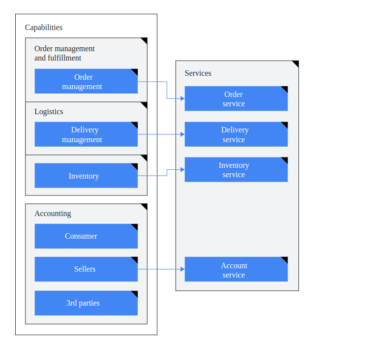
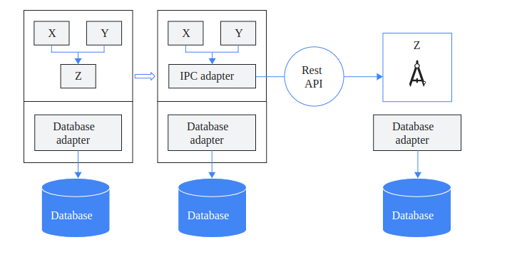
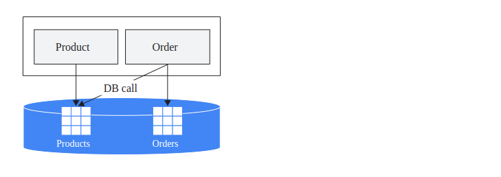

## Como refatorar um monolítico em microsserviços

Para realizar a modernização do aplicativo, recomendamos que você não refatore todo o código ao mesmo tempo. 
Em vez disso, recomendamos que você refatore gradualmente o aplicativo monolítico. Ao refatorar gradualmente um aplicativo, 
você cria gradualmente um novo aplicativo que consiste em microsserviços e o executa junto do aplicativo monolítico. 
Essa abordagem também é conhecida como padrão Strangler Fig (em inglês). 
Com o tempo, a quantidade de funcionalidade implementada pelo aplicativo monolítico diminui até que desaparecer completamente ou se tornar outro microsserviço.

Os microserviços exigem muito mais automação: pense com antecedência sobre integração contínua (CI, na sigla em inglês), implantação contínua (CD, na sigla em inglês), 
geração de registros central e monitoramento.

### Desacoplar por design orientado a domínio

Os microsserviços precisam ser projetados para recursos de negócios, não para camadas horizontais, como acesso a dados ou mensagens. Os microsserviços também precisam ter acoplamento flexível e coesão funcional alta. 
Os microserviços são acoplados com flexibilidade se você puder alterar um serviço sem exigir que outros serviços sejam atualizados ao mesmo tempo. 
Um microsserviço é coeso se tiver uma única finalidade bem definida, como gerenciar contas de usuário ou processar pagamentos.

* Identifique um idioma onipresente, (em inglês) um vocabulário comum compartilhado entre todas as partes interessadas. Como desenvolvedor, é importante usar termos no código que uma pessoa não técnica possa entender. 
O que o código está tentando alcançar precisa ser um reflexo dos processos da empresa.
* Identifique os módulos (em inglês) relevantes no aplicativo monolítico e aplique o vocabulário comum a esses módulos.
* Defina contextos limitados (em inglês) em que você aplica limites explícitos aos módulos identificados com responsabilidades claramente definidas. 
Os contextos limitados que você identifica são candidatos a serem refatorados em microsserviços menores.

### Exemplo:

Figura 1. Os recursos do aplicativo são separados em contextos delimitados que migram para serviços.

### Priorizar serviços para migração

Um ponto de partida ideal para separar os serviços é identificar os módulos acoplados com flexibilidade no aplicativo monolítico. 
É possível escolher um módulo acoplado com flexibilidade como um dos primeiros candidatos a converter como um microsserviço. 
Para fazer uma análise de dependência de cada módulo, observe o seguinte:

* O tipo da dependência: dependências de dados ou outros módulos.
* Escala da dependência: como uma alteração no módulo identificado pode afetar outros módulos.

### Extrair um serviço de um monolítico

Depois de identificar o candidato ideal para o serviço, identifique uma maneira de fazer os módulos de microsserviço e monolítico coexistirem. 
Uma maneira de gerenciar essa coexistência é introduzir um adaptador de comunicação entre processos (IPC, na sigla em inglês), que pode ajudar os módulos a funcionarem juntos.

O diagrama a seguir mostra como implementar a abordagem da IPC:

Figura 2. Um adaptador IPC coordena a comunicação entre o aplicativo monolítico e um módulo de microsserviços.

Na figura 2, o módulo Z é o candidato ao serviço que você quer extrair do aplicativo monolítico. 
Os módulos X e Y dependem do módulo Z. 
Os módulos de microserviço X e Y usam um adaptador IPC no aplicativo monolítico para se comunicarem com o módulo Z por uma API REST.

### Gerenciar um banco de dados monolítico

Para determinar onde dividir um banco de dados monolítico, primeiro analise os mapeamentos do banco de dados. Como parte da análise de extração de serviço, você coletou alguns insights sobre os microsserviços que precisa criar. Use a mesma abordagem para analisar o uso do banco de dados e mapear tabelas ou outros objetos de banco de dados para os novos microsserviços. Ferramentas como SchemaTracker, SchemaSpy ERBuilder (links em inglês) podem ajudar você a realizar essa análise. O mapeamento de tabelas e outros objetos ajuda a entender o acoplamento entre os objetos de banco de dados que abrangem os limites de microsserviços em potencial.

No entanto, dividir um banco de dados monolítico é complexo porque pode não haver uma separação clara entre os objetos do banco de dados. Você também precisa considerar outros problemas, como sincronização de dados, integridade transacional, mesclagens e latência. A próxima seção descreve padrões que podem ajudar a responder a esses problemas ao dividir o banco de dados monolítico.

### Tabelas de referência

É comum que os módulos acessem dados necessários em um módulo diferente por uma mescla de SQL na tabela do outro módulo. O diagrama a seguir usa o exemplo de aplicativo de comércio eletrônico anterior para mostrar esse processo de acesso da mescla do SQL:

Figura 3. Um módulo mescla dados na tabela de um módulo diferente.

Na figura 3, para receber informações do produto, um módulo de pedido usa uma chave externa product_id para mesclar um pedido à tabela de produtos.

No entanto, se você desconstruir módulos como serviços individuais, recomendamos que não faça com que o serviço de pedido chame diretamente o banco de dados do serviço de produto para executar uma operação de mesclagem. As seções a seguir descrevem opções que podem ser consideradas para separar os objetos do banco de dados.

### Compartilhar dados por uma API

