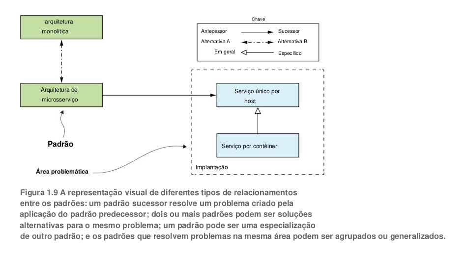
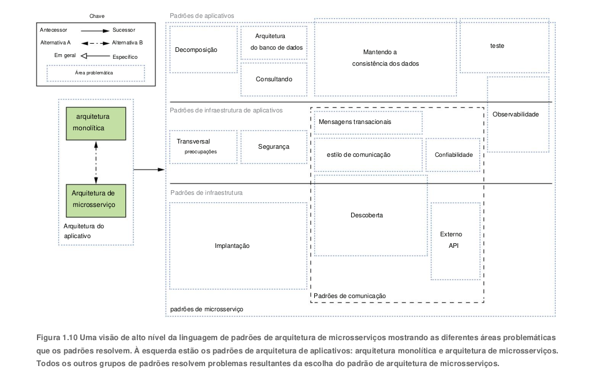
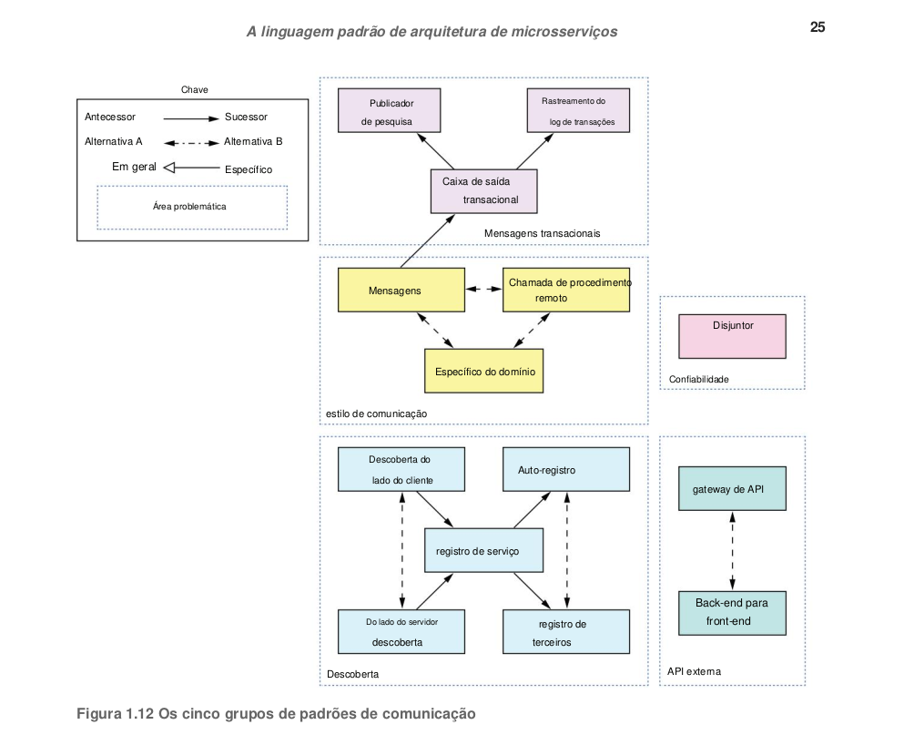
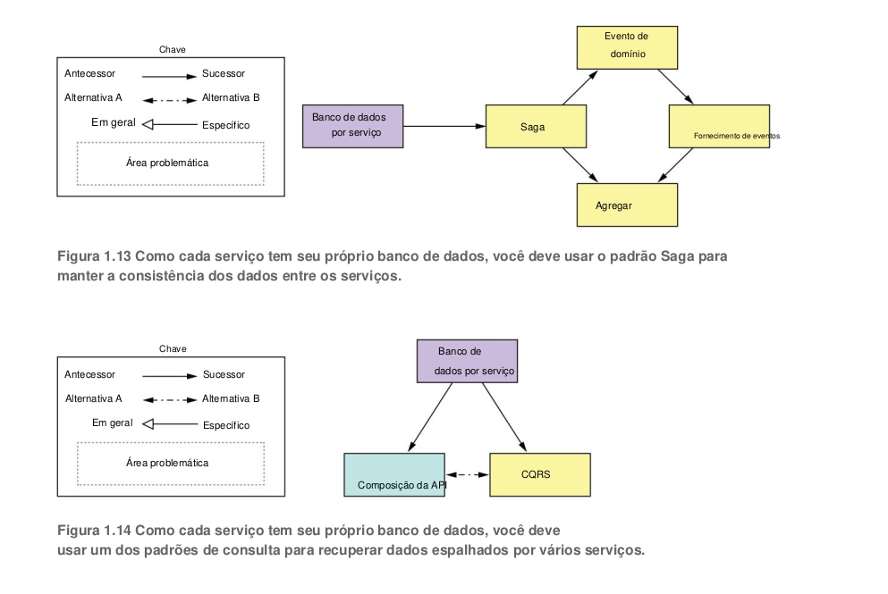
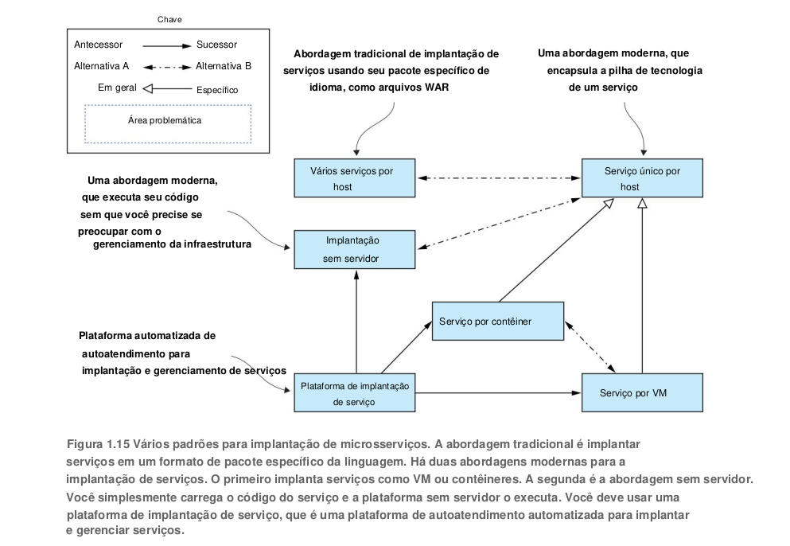
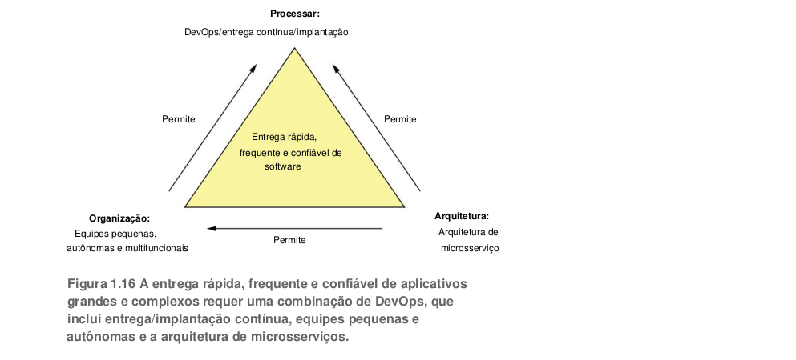

## Como refatorar um monolítico em microsserviços

A equipe FTGO também tem problemas para dimensionar seu aplicativo. Isso ocorre porque diferentes
módulos de aplicativos têm requisitos de recursos conflitantes. Os dados do restaurante, por exemplo,
são armazenados em um grande banco de dados na memória, idealmente implantado em servidores
com muita memória. Por outro lado, o módulo de processamento de imagem é intensivo em CPU e
melhor implantado em servidores com muita CPU. Como esses módulos fazem parte do mesmo
aplicativo, o FTGO deve comprometer a configuração do servidor.

Outro problema com o aplicativo FTGO é a falta de confiabilidade. Como resultado, há frequentes
interrupções na produção. Uma razão pela qual não é confiável é que testar o aplicativo completamente
é difícil, devido ao seu grande tamanho. Essa falta de testabilidade significa que os bugs entram na
produção.

[Código git](https://github.com/eventuate-tram/eventuate-tram-sagas)

//página 38

1.4.1 Cubo

O cubo de escala define três maneiras separadas de dimensionar um aplicativo: a
escalabilidade do eixo X equilibra as solicitações em várias instâncias idênticas; As solicitações
de roteamento de escala do eixo Z com base em um atributo da solicitação; O eixo Y decompõe
funcionalmente um aplicativo em serviços.

ESCALA DO EIXO X BALANÇOS DE CARGA SOLICITAÇÕES EM
MÚLTIPLAS INSTÂNCIAS A escala do eixo X é uma maneira comum de escalar um aplicativo monolítico.
A Figura 1.4 mostra como funciona a escala do eixo X. Você executa várias instâncias do aplicativo atrás
de um balanceador de carga. O balanceador de carga distribui as solicitações entre as N instâncias
idênticas do aplicativo. Essa é uma ótima maneira de melhorar a capacidade e a disponibilidade de um
aplicativo.

ESCALA DO EIXO Z ROTA SOLICITAÇÕES BASEADAS EM UM ATRIBUTO
DA SOLICITAÇÃO A escala do eixo Z também executa várias instâncias do aplicativo monolítico, mas
diferentemente da escala do eixo X, cada instância é responsável por apenas um subconjunto dos dados.
A Figura 1.5 mostra como funciona a escala do eixo Z. O roteador na frente das instâncias usa um
atributo de solicitação para roteá-lo para a instância apropriada. Um aplicativo pode, por exemplo, rotear
solicitações usando userId.

O dimensionamento do eixo Z é uma ótima maneira de dimensionar um aplicativo para lidar com volumes crescentes de transações e dados.

#### O ESCALAMENTO DO EIXO Y DECOMPÕE FUNCIONALMENTE UM APLICATIVO EM SERVIÇOS

Um serviço é um miniaplicativo que implementa funcionalidade com foco restrito, como gerenciamento de
pedidos, gerenciamento de clientes e assim por diante. Um serviço é dimensionado usando a escala do eixo
X, embora alguns serviços também possam usar a escala do eixo Z. Por exemplo, o serviço Order consiste
em um conjunto de instâncias de serviço com balanceamento de carga.
A definição de alto nível da arquitetura de microsserviços (microsserviços) é um estilo de arquitetura
que decompõe funcionalmente um aplicativo em um conjunto de serviços. Note que esta definição não diz
nada sobre tamanho. Em vez disso, o que importa é que cada serviço tenha um conjunto de responsabilidades
focado e coeso.

### 1.4.2 Microsserviços como forma de modularidade

A modularidade é essencial ao desenvolver aplicativos grandes e complexos. Um aplicativo moderno como
o FTGO é muito grande para ser desenvolvido por um indivíduo. Também é muito complexo para ser
entendido por uma única pessoa. Os aplicativos devem ser decompostos em módulos que são desenvolvidos
e compreendidos por diferentes pessoas.

Em um aplicativo monolítico, os módulos são definidos usando
uma combinação de construções de linguagem de programação (como pacotes Java) e artefatos de
construção (como arquivos Java JAR). No entanto, como os desenvolvedores do FTGO descobriram, essa
abordagem tende a não funcionar bem na prática. Aplicações monolíticas de longa duração geralmente
degeneram em grandes teias de aranhas.

A arquitetura de microsserviços usa serviços como unidade de modularidade.

Como resultado, é muito mais fácilpreservar a modularidade do aplicativo ao longo do tempo. Existem outros benefícios de usar serviços como
blocos de construção, incluindo a capacidade de implantá-los e escalá-los de forma independente.

### Regra de OURO: Cada serviço possui seu próprio banco de dados

Uma característica chave da arquitetura de microsserviço é que os serviços são fracamente acoplados e se
comunicam apenas por meio de APIs. Uma maneira de obter acoplamento flexível é cada serviço ter seu
próprio armazenamento de dados. Na loja online, por exemplo, o Serviço de Pedidos possui um banco de
dados que inclui a tabela PEDIDOS , e o Atendimento ao Cliente possui seu banco de dados, que inclui a
tabela CLIENTES . No momento do desenvolvimento, os desenvolvedores podem alterar o esquema de um
serviço sem precisar coordenar com os desenvolvedores que trabalham em outros serviços. No tempo de
execução, os serviços são isolados uns dos outros — por exemplo, um serviço nunca será bloqueado porque
outro serviço mantém um bloqueio de banco de dados.

### A arquitetura de microsserviços exemplo FTGO

Ponto forte, cada um pode ser desenvolvido, testado, implantado e dimensionado de forma independente.

### A linguagem padrão de arquitetura de microsserviços

Arquitetura e design têm tudo a ver com tomada de decisões. Você precisa decidir se a arquitetura
monolítica ou de microsserviço é a mais adequada para seu aplicativo.

Uma boa maneira de descrever as várias opções de arquitetura e design e melhorar a tomada de
decisões é usar uma linguagem de padrões. Vamos primeiro ver por que precisamos de padrões e
de uma linguagem de padrões e, em seguida, faremos um tour pela linguagem de padrões de
arquitetura de microsserviços.

Um padrão é uma solução reutilizável para um problema que ocorre em um contexto particular.

Deploy a service as a container é uma especialização de Single service per host.

### Visão geral da linguagem padrão de arquitetura de microsserviços

A linguagem de padrão de arquitetura de microsserviço é uma coleção de padrões que ajudam você a arquitetar um aplicativo usando a arquitetura de microsserviço

A linguagem padrão primeiro ajuda você a decidir se deve usar a
arquitetura de microsserviço. Ele descreve a arquitetura monolítica e a arquitetura de microsserviços,
juntamente com seus benefícios e desvantagens. Então, se a arquitetura de microsserviço for
adequada para seu aplicativo, a linguagem padrão ajudará você a usá-la de forma eficaz, resolvendo
vários problemas de arquitetura e design

A linguagem padrão consiste em vários grupos de padrões. À esquerda na figura 1.10 está o
grupo de padrões de arquitetura de aplicativos, o padrão de arquitetura monolítica e o padrão de
arquitetura de microsserviços. Esses são os padrões que discutimos

#### PADRÕES PARA DECOMPOSIÇÃO DE UM APLICATIVO EM SERVIÇOS

Decidir como decompor um sistema em um conjunto de serviços é uma arte, mas há várias estratégias que
podem ajudar. Os dois padrões de decomposição mostrados na figura 1.11 são estratégias diferentes que você
pode usar para definir a arquitetura de seu aplicativo

#### PADRÕES DE COMUNICAÇÃO

#### PADRÕES DE OBSERVABILIDADE FORNECEM INSIGHTS SOBRE O COMPORTAMENTO DO APLICATIVO

entender e diagnosticar problemas em uma arquitetura de microsserviço é muito
mais complicado. Uma solicitação pode oscilar entre vários serviços antes que uma resposta seja
finalmente retornada a um cliente. Conseqüentemente, não há um arquivo de log para examinar. Da
mesma forma, problemas com latência são mais difíceis de diagnosticar porque existem vários
suspeitos.

#### PADRÕES PARA O TESTE AUTOMÁTICO DE SERVIÇOS

A arquitetura de microsserviço facilita o teste de serviços individuais porque eles são muito menores do que o aplicativo
monolítico. Ao mesmo tempo, porém, é importante testar se os diferentes serviços funcionam juntos, evitando o uso de
testes de ponta a ponta complexos, lentos e frágeis que testam vários serviços juntos. Aqui estão os padrões para simplificar
o teste testando serviços isoladamente:
* Teste de contrato orientado ao consumidor — Verifica se um serviço atende às expectativas de seu
clientes.
* Teste de contrato do lado do consumidor - Verifique se o cliente de um serviço pode se comunicar
com o serviço.
* Teste de componente de serviço 
* Teste um serviço isoladamente.

Padrão Microservice Chassis -- 

### Além dos microsserviços: processo e organização

Para um aplicativo
grande e complexo, a arquitetura de microsserviço geralmente é a melhor escolha. Mas, além de ter a
arquitetura certa, o desenvolvimento de software de sucesso exige que você também tenha organização
e processos de desenvolvimento e entrega.

#### Desenvolvimento de software e organização de entrega

O sucesso inevitavelmente significa que a equipe de engenharia crescerá. Por um lado, isso é bom
porque mais desenvolvedores podem fazer mais. O problema com equipes grandes é, como Fred
Brooks escreveu em The Mythical Man-Month, a comunicação aérea de uma equipe de tamanho N é
O(N^2). Se a equipe ficar muito grande, ela se tornará ineficiente devido à sobrecarga de comunicação. 
Imagine, por exemplo, tentar fazer uma diária com 20 pessoas

Para  entregar software de forma eficaz ao usar a arquitetura de microsserviços, você precisa levar em
consideração a lei de Conway (https://en.wikipedia.org/wiki/Conway%27s _law), que afirma o seguinte:
Organizações que projetam sistemas … são obrigadas a produzir projetos que são cópias das
estruturas de comunicação dessas organizações.
Melvin Conway
Em outras palavras, a arquitetura do seu aplicativo reflete a estrutura da organização que o desenvolveu.
É importante, portanto, aplicar a lei de Conway ao contrário (www.thoughtworks.com/radar/techniques/
inverse-conway-maneuver) e projete sua organização para que sua estrutura espelhe sua arquitetura de
microsserviço. Ao fazer isso, você garante que suas equipes de desenvolvimento sejam tão frouxamente
acopladas quanto os serviços.

#### Processo de desenvolvimento e entrega de software

Usar a arquitetura de microsserviços com um processo de desenvolvimento em cascata é como
dirigir uma Ferrari puxada a cavalo — você desperdiça a maior parte do benefício de usar
microsserviços. Se você deseja desenvolver um aplicativo com a arquitetura de microsserviços, é
essencial adotar práticas ágeis de desenvolvimento e implantação, como Scrum ou Kanban.

#### Mova-se rapidamente sem quebrar as coisas

O objetivo da entrega/implantação contínua (e, mais geralmente, DevOps) é entregar
software de maneira rápida, mas confiável. Quatro métricas úteis para avaliar o desenvolvimento
de software são as seguintes:

* Frequência de implantação—Com que frequência o software é implantado na produção ÿ
Lead time—Tempo de um desenvolvedor verificando uma alteração até que a alteração seja
implantado
* Tempo médio de recuperação—Tempo de recuperação de um problema de produção
* Taxa de falha de alteração—Percentual de alterações que resultam em um problema de produção

#### O lado humano da adoção de microsserviços

Adotar a arquitetura de microsserviço muda sua arquitetura, sua organização e seus processos
de desenvolvimento. Em última análise, porém, muda o ambiente de trabalho das pessoas, que
são, como mencionado anteriormente, criaturas emocionais. Se ignoradas, suas emoções podem
tornar a adoção de microsserviços uma jornada acidentada.

1. Terminar, Perder e Deixar Ir — O período de turbulência emocional e resistência quando
   as pessoas se deparam com uma mudança que as força a sair de sua zona de conforto.
   Muitas vezes lamentam a perda da velha maneira de fazer as coisas. Por exemplo,
   quando as pessoas se reorganizam em equipes multifuncionais, elas sentem falta de seus
   ex-companheiros de equipe. Da mesma forma, um grupo de modelagem de dados que
   possui o modelo de dados global será ameaçado pela ideia de cada serviço ter seu próprio
   modelo de dados.

2. A Zona Neutra — O estágio intermediário entre as velhas e as novas maneiras de fazer as coisas,
onde as pessoas geralmente se confundem. Muitas vezes, eles estão lutando para aprender a
nova maneira de fazer as coisas.

3. O novo começo—O estágio final em que as pessoas abraçaram com entusiasmo a nova maneira de
fazer as coisas e estão começando a experimentar os benefícios.

## Estratégias de decomposição

O principal desafio, que é a essência da arquitetura de microsserviços, é a decomposição funcional da aplicação em serviços.
O primeiro e mais importante aspecto da arquitetura é, portanto, a definição dos serviços.
Os serviços são organizados em torno de preocupações comerciais, e não técnicas.

todo 64