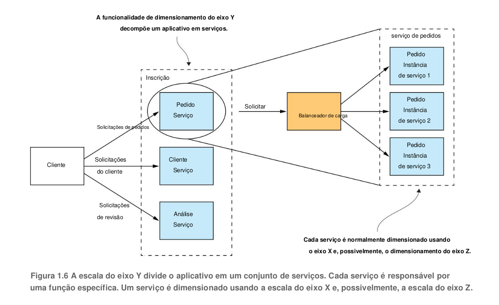

## Como refatorar um monolítico em microsserviços

A equipe FTGO também tem problemas para dimensionar seu aplicativo. Isso ocorre porque diferentes
módulos de aplicativos têm requisitos de recursos conflitantes. Os dados do restaurante, por exemplo,
são armazenados em um grande banco de dados na memória, idealmente implantado em servidores
com muita memória. Por outro lado, o módulo de processamento de imagem é intensivo em CPU e
melhor implantado em servidores com muita CPU. Como esses módulos fazem parte do mesmo
aplicativo, o FTGO deve comprometer a configuração do servidor.

Outro problema com o aplicativo FTGO é a falta de confiabilidade. Como resultado, há frequentes
interrupções na produção. Uma razão pela qual não é confiável é que testar o aplicativo completamente
é difícil, devido ao seu grande tamanho. Essa falta de testabilidade significa que os bugs entram na
produção.

[Código git](https://github.com/eventuate-tram/eventuate-tram-sagas)

//página 38

1.4.1 Cubo

O cubo de escala define três maneiras separadas de dimensionar um aplicativo: a
escalabilidade do eixo X equilibra as solicitações em várias instâncias idênticas; As solicitações
de roteamento de escala do eixo Z com base em um atributo da solicitação; O eixo Y decompõe
funcionalmente um aplicativo em serviços.

ESCALA DO EIXO X BALANÇOS DE CARGA SOLICITAÇÕES EM
MÚLTIPLAS INSTÂNCIAS A escala do eixo X é uma maneira comum de escalar um aplicativo monolítico.
A Figura 1.4 mostra como funciona a escala do eixo X. Você executa várias instâncias do aplicativo atrás
de um balanceador de carga. O balanceador de carga distribui as solicitações entre as N instâncias
idênticas do aplicativo. Essa é uma ótima maneira de melhorar a capacidade e a disponibilidade de um
aplicativo.

ESCALA DO EIXO Z ROTA SOLICITAÇÕES BASEADAS EM UM ATRIBUTO
DA SOLICITAÇÃO A escala do eixo Z também executa várias instâncias do aplicativo monolítico, mas
diferentemente da escala do eixo X, cada instância é responsável por apenas um subconjunto dos dados.
A Figura 1.5 mostra como funciona a escala do eixo Z. O roteador na frente das instâncias usa um
atributo de solicitação para roteá-lo para a instância apropriada. Um aplicativo pode, por exemplo, rotear
solicitações usando userId.

O dimensionamento do eixo Z é uma ótima maneira de dimensionar um aplicativo para lidar com volumes crescentes de transações e dados.

#### O ESCALAMENTO DO EIXO Y DECOMPÕE FUNCIONALMENTE UM APLICATIVO EM SERVIÇOS

Um serviço é um miniaplicativo que implementa funcionalidade com foco restrito, como gerenciamento de
pedidos, gerenciamento de clientes e assim por diante. Um serviço é dimensionado usando a escala do eixo
X, embora alguns serviços também possam usar a escala do eixo Z. Por exemplo, o serviço Order consiste
em um conjunto de instâncias de serviço com balanceamento de carga.
A definição de alto nível da arquitetura de microsserviços (microsserviços) é um estilo de arquitetura
que decompõe funcionalmente um aplicativo em um conjunto de serviços. Note que esta definição não diz
nada sobre tamanho. Em vez disso, o que importa é que cada serviço tenha um conjunto de responsabilidades
focado e coeso.

### 1.4.2 Microsserviços como forma de modularidade

A modularidade é essencial ao desenvolver aplicativos grandes e complexos. Um aplicativo moderno como
o FTGO é muito grande para ser desenvolvido por um indivíduo. Também é muito complexo para ser
entendido por uma única pessoa. Os aplicativos devem ser decompostos em módulos que são desenvolvidos
e compreendidos por diferentes pessoas.

Em um aplicativo monolítico, os módulos são definidos usando
uma combinação de construções de linguagem de programação (como pacotes Java) e artefatos de
construção (como arquivos Java JAR). No entanto, como os desenvolvedores do FTGO descobriram, essa
abordagem tende a não funcionar bem na prática. Aplicações monolíticas de longa duração geralmente
degeneram em grandes teias de aranhas.

A arquitetura de microsserviços usa serviços como unidade de modularidade.

Como resultado, é muito mais fácilpreservar a modularidade do aplicativo ao longo do tempo. Existem outros benefícios de usar serviços como
blocos de construção, incluindo a capacidade de implantá-los e escalá-los de forma independente.

### Regra de OURO: Cada serviço possui seu próprio banco de dados

Uma característica chave da arquitetura de microsserviço é que os serviços são fracamente acoplados e se
comunicam apenas por meio de APIs. Uma maneira de obter acoplamento flexível é cada serviço ter seu
próprio armazenamento de dados. Na loja online, por exemplo, o Serviço de Pedidos possui um banco de
dados que inclui a tabela PEDIDOS , e o Atendimento ao Cliente possui seu banco de dados, que inclui a
tabela CLIENTES . No momento do desenvolvimento, os desenvolvedores podem alterar o esquema de um
serviço sem precisar coordenar com os desenvolvedores que trabalham em outros serviços. No tempo de
execução, os serviços são isolados uns dos outros — por exemplo, um serviço nunca será bloqueado porque
outro serviço mantém um bloqueio de banco de dados.

### A arquitetura de microsserviços exemplo FTGO

Ponto forte, cada um pode ser desenvolvido, testado, implantado e dimensionado de forma independente.

//TODO 47

