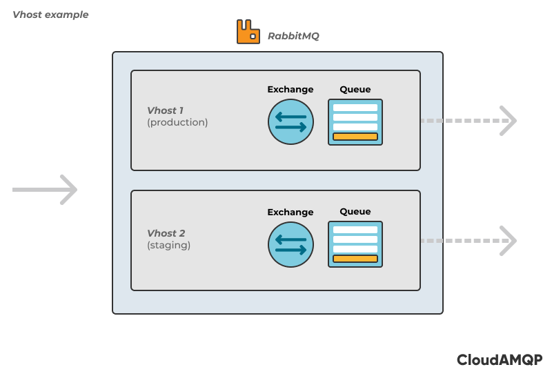
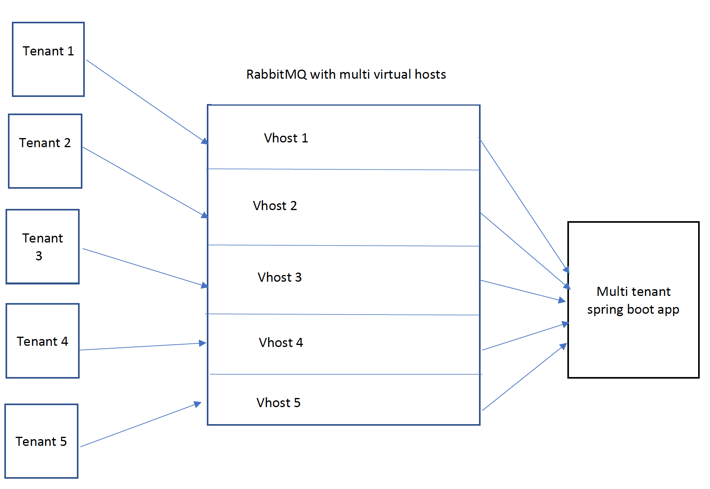
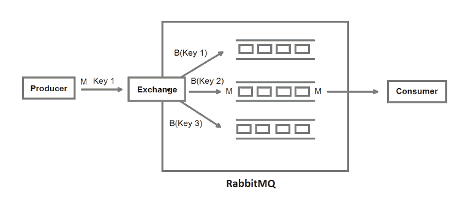

## RPC

O modelo Remote Procedure Call ( RPC) foi um dos muitos casos de uso nos anos 60, quando a computação distribuída era um desafio ( ainda é).
O modelo RPC é considerado um protocolo de solicitação-resposta , onde você tem um cliente que inicia um processo enviando uma mensagem de solicitação a um servidor remoto para executar uma ou várias tarefas.
Em seguida, o servidor remoto envia uma resposta ao cliente para que ele possa continuar com o processo.

@RabbitListener : Você já está familiarizado com esta anotação.
Ele criará um contêiner de ouvinte de mensagens e atenderá todas as mensagens recebidas da fila
apress.amqp.queue (lembre-se de que esta é uma propriedade especificada no arquivo application.properties ).

O Spring AMQP inclui a anotação @SendTo , pela qual você pode enviar sua resposta para uma troca ou para uma fila.
```java
@RabbitListener(queues="${apress.amqp.queue}")
    @SendTo("${apress.amqp.reply-exchange-queue}")
    public Message<String> replyToProcess(String message){
    }
```

Tentativas : Às vezes, você receberá um erro, seja processando a mensagem ou pelo agente, e precisará tentar novamente no nível do consumidor.
Você precisa usar esse recurso para esse cenário:

```java
@Bean
public StatefulRetryOperationsInterceptor interceptor() {
        return RetryInterceptorBuilder.stateful()
                .maxAttempts(3)
                .backOffOptions(1000, 2.0, 10000)
                .build();
}
```
Ou isto:


```java 
@Bean
RetryOperationsInterceptor interceptor(
        RabbitTemplate template,
@Value("${apress.amqp.error-exchange:}")String errorExchange,
@Value("${apress.amqp.error-routing-key}")    String
                                  errorExchangeRoutingKey) {
        return RetryInterceptorBuilder.stateless()
                        .maxAttempts(3)
                        .recoverer(
                new RepublishMessageRecoverer(template, errorExchange,
                errorExchangeRoutingKey))
                        .build();
}`
```
## Multi host rabbit

Como o rabbit trabalha com virtual hosts(seriam os tenants):



Idéia principal é a seguinte:



Ou seja dessa forma cada tenant vai ter seu vhost sem interferir um no outro, para fazer isso
podemos contar com essa [lib](https://github.com/freenowtech/spring-multirabbit)

Para configurar com a lib fica muito simples, precisamos fazer algo como:

```yaml
spring:
    rabbitmq:
        host: localhost
        port: 5672
    multirabbitmq:
        enabled: true
        connections:
            connectionNameA:
                defaultConnection: true
                host: localhost/vHost1
                port: 5672
            connectionNameB:
                host: localhost/vHost2
                port: 5672
```

Traduzimos cada conexão como um tenant com um vHost, assim por diante.

## Rabbit com exchange com routekey

Como mostra a imagem o routekey traz um tipo de strategy, há um ponto de entrada 
e dependendo a routekey vai para determinada queue...



A implementação é bem simples o que facilita a implementação

```java
@Configuration
public class RabbitMQDirectConfig {

    @Bean
    Queue marketingQueue() {
        return new Queue("marketingQueue", false);
    }

    @Bean
    Queue financeQueue() {
        return new Queue("financeQueue", false);
    }

    @Bean
    Queue adminQueue() {
        return new Queue("adminQueue", false);
    }

    @Bean
    DirectExchange exchange() {
        return new DirectExchange("direct-exchange");
    }

    @Bean
    Binding marketingBinding(Queue marketingQueue, DirectExchange exchange) {
        return BindingBuilder.bind(marketingQueue).to(exchange).with("marketing");
    }

    @Bean
    Binding financeBinding(Queue financeQueue, DirectExchange exchange) {
        return BindingBuilder.bind(financeQueue).to(exchange).with("finance");
    }

    @Bean
    Binding adminBinding(Queue adminQueue, DirectExchange exchange) {
        return BindingBuilder.bind(adminQueue).to(exchange).with("admin");
    }

} 
```

Exemplo de envio para fila


```java
@RestController
@RequestMapping(value = "/javainuse-rabbitmq/direct/")
public class RabbitMQDirectWebController {

	@Autowired
	private AmqpTemplate amqpTemplate;

	@GetMapping(value = "/producer")
	public String producer(@RequestParam("exchangeName") String exchange, @RequestParam("routingKey") String routingKey,
			@RequestParam("messageData") String messageData) {

		amqpTemplate.convertAndSend(exchange, routingKey, messageData);

		return "Message sent to the RabbitMQ Successfully";
	}

}
```

Bem simples só dizer para qual routingKey será enviada e o rabbit faz todo o trabalho

O consumer também é bem simples só aponta pra determinada fila, conforme exemplo:

```java

public class TesteConsumer {

    @RabbitListener(queues = "#{autoDeleteQueue1.name}")
    public void receive1(String in) throws InterruptedException {
        receive(in, 1);
    }

    @RabbitListener(queues = "#{autoDeleteQueue2.name}")
    public void receive2(String in) throws InterruptedException {
        receive(in, 2);
    }
}

```
